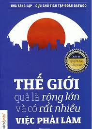
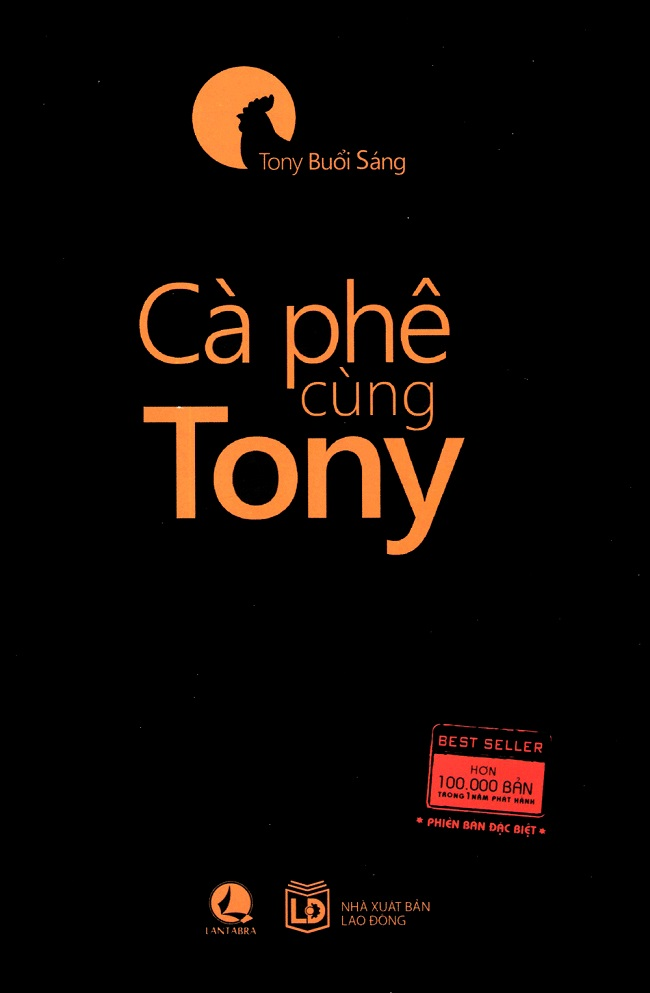
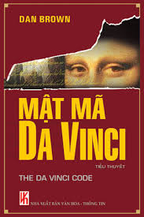
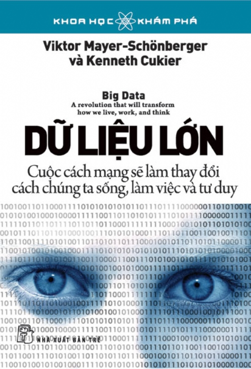
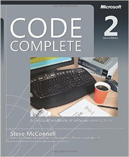
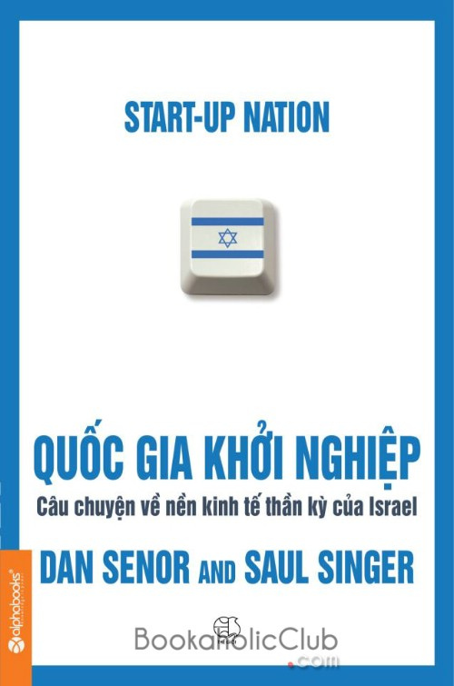
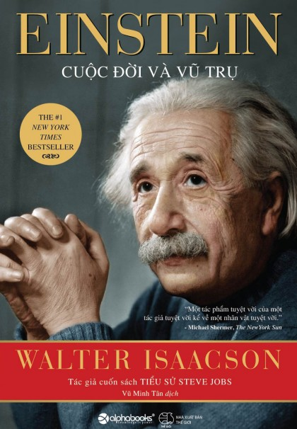



	

		
		
	

 
<blockquote class="intro">

	
Xin Chào tôi tên là <strong>Lục Văn Minh</strong>, tôi là một người trầm tính it nói và lười nhác . Cuộc đời đối với tôi khá đơn có <strong>gia đình</strong>, có <strong>bạn bè</strong> là có tất cả, à còn cần có <strong>mạng</strong> nữa chứ nhỉ. Đam mê lớn nhất của tôi là <strong>lập trình</strong>, và tôi quết định giành cả tuổi thanh xuân để theo đuổi đam mê của mình, từ những dòng code của mình tôi hy vọng sẽ góp phần cho thế giới tốt đẹp hơn.

</blockquote>

	

		

		

		

		

		
		<h4 class="text">Về Cuộc Sống</h4>
		

		

		

			Cuộc sống của tôi khá đơn giản, ngoài lập trình thì và thời gian rảnh tồi thường <strong>lưót ưeb</strong> tìm hiểu sự tình giang hồ, các <strong>công ngệ mới</strong> cũng như <trong>hackernews</trong>. vói các hoạt offline, tôi thích <strong>ăn</strong> và thích nấu ăn, <trong>đọc sách</trong>. môn thể tao yêu thích của tôi là <strong>chạy bộ</strong> và <strong>bơi lội</strong>, có lẽ tại không giỏi môn nào khác :).
		

	

	

		

		

		

		

		
		<h4 class="text">Về Động Lực</h4>
		

		

		

			Tôi luôn muốn học hỏi những <strong>điều mới mể</strong>, đi lên những <strong>vùng đất mới</strong>, trả nghiệp những nền <strong>văn hóa mới</strong> và nếm thử những <strong>mốn ăn mới</strong>. với công việc tôi luôn muốn hoàn thiện <strong>kỹ năng</strong> cũng như <strong>tu duy</strong> của mình để mỗi sản phẩm của mình đều <strong>chạm đến trái tim của người dùng</strong>. 
		

	

	

		

		

		

		

		
		<h4 class="text">Về Lập Trình</h4>
		

		

		

			Tôi có một niềm đam mê với <strong>lập trình</strong> nói chung và <strong>lập trình web</strong> nói riêng. Tôi thích sự tiện lợi của <strong>PHP</strong>, yêu  sự ôn định của <strong>java</strong>,  yêu sự mềm dẻo của <strong>javascript</strong>, sự mạnh mẽ của <strong>python</strong>, sự đơn giản của <strong>ruby</strong>. ngoài ra tôi cũng thích những front-end frameworks như <strong>React</strong>, <strong>Angular 2</strong>, <strong>Polymer</strong>. môi trường lập trình yêu thích của tôi là <strong>Linux</strong> và các IDE của <strong>JetBrain</strong>.
		

	

	

		
 
		

		

		

		
		<h4 class="text">Về Mã Nguồn Mở</h4>
		

		

		

			Tất nhiên rồi, tôi yêu mã nguồn mở và gành cả ngày trên <strong>github</strong>. Thật hạnh phúc khi đưọc đóng góp cho những dự án tuyệt vời như <strong>LearnPress</strong> ..., tôi sẵn sàng tham gia vào các dự án mã nguồn mở ý nghĩa, cho đi cũng là nhận lại, vì một cộng đồng mã ngồn mở lớn mạnh.
		

	



## Chỉ Mục
dưới đâu là những trang ưeb tôi thường xuyên lui tới, đây à những nguôn thông tin khổng lồ giúp tôi giải trí cũng như hoàn thiên bản thân mình hơn.

- [medium](http://medium.com) 👉 tất cả trên một trang duy nhất
- [wait but why](http://waitbutwhy.com/) 👉 nhìn cưọc sống qua một góc nhìn mới
- [Freecodecamp](https://medium.freecodecamp.com/)  👉 một cộng đòng năng động và tụ vị
- [hackernews](https://news.ycombinator.com/) 👉 tổng hợp tin tức công nghệ
- [TED](https://www.ted.com/) 👉 nơi chia sẻ những câu chuyện ý nghĩa, những ý tưởng kiệt suất
- [Javascript sence](https://medium.com/javascript-scene) 👉 mọi khía cạnh của javascript
- [techtalk](http://techtalk.vn/) 👉  tin tức công nghệ tiwngs việt
- [toidicodedao](toidicodedao.com) 👉 những câu chuyện chận thực về cuộc sống của lập trình viên
- [daynhauhoc](https://daynhauhoc.com)  👉  diên đần trao đổi về công nghệ

## Sách
tôi đã học được rất nhiều từ những cuốn sách này: 



	

		
	

	

		
	

	

		
	

	

		
	

	

		
	

	

	
	

	

		
	

	

		
	



## Liên Hệ
hiện tai tôi đang sinh sống và làm việc tại <strong>Hà Nội</strong>.
Bạn có thể liên hệ với tôi bất cứ lúc nào qua:

- email: [luk.mink@gmail.com](mailto:luk.mink@gmail.com) 
- facebook: [minhlucvan3](https://fb.com/minhlucvan3)
- twiter: [@Minhlucvan](https://twitter.com/Minhlucvan)
- skype: live:minhmeo004

Rất vui khi được làm quen với bạn.



